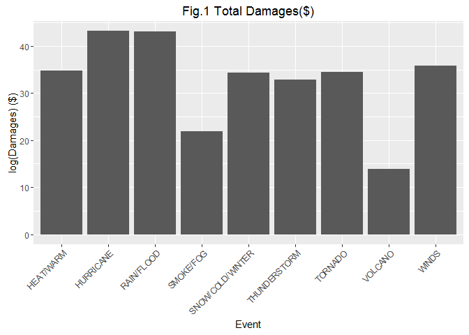

# NOAA Storm Data Research
Rajiv Soundararajan  
18 Sep 2016  


# Abstract
In this report we are analyzing the NOAA storm data for the economic and health damages caused by the various weather events.

For this report and analysis , only events pertaining to below list are taken into account. 

1. Thunderstorm
2. Winds
3. Snow & Cold
4. Smoke or Fog
5. Rain & Floods
6. Heat 
7. Tornado
8. Hurricane
9. Volcano

The assumption here is that the damage to the economy and health would be more with these events than others. Also multiple types of events of same weather phenomenon are gathered into single group. 
viz. SNOW|ICE|WINTER|CHILL|COLD|FROST|BLIZZARD|FREEZ are all representative of winter weather conditions. So its safe to assume and analyze the damages caused in a particular season of the year .

Though the caveat here with this type of approximation is that the phenomenon acting as a causational agents for other types of weather events would accounted incorrectly. e.g. "Thunderstorm Winds" would be bucketed under Thunderstorm category than the Winds category. But its a safe assumption, which will not distort our analysis for such overlapping events

We will also look at how trend of the damages in dollars over every decade for each event.

# Synopsis

In Fig.1 we are analyzing the different damages inflicted by the different weather events 

1. Financial damages are reported in log scale of total dollars. 
2. Health damages are reported as the count of total damages.

From Fig.2 we can notice that there is a strong correlation between the damage($) and the total fatalities.
It can be concluded that the events which has caused high fatalities has also caused high property/economic damages. Also we can see that the event type "Tornado" is an outlier to this relationship

Fig.3 gives us a glimpse into the damages caused by the weather events across each decade.
Also we can conclude that almost all weather events have a decreasing trend of damages.
This could be because of better prediction of the weather situation and taking precuatinary measures.


# Data Analysis

### Preparation of Data

Following are the features-of-interests extracted from the data :

1. Begin Date
2. State
3. Event Type
4. Fatalities
5. Injuries
6. Property Damages
7. Crop Damages


```r
# prepare & clean data

if(!file.exists("StormData.csv.bz2")){
    download.file("https://d396qusza40orc.cloudfront.net/repdata%2Fdata%2FStormData.csv.bz2", destfile = "StormData.csv.bz2")    
}

data = read.csv("StormData.csv.bz2")

noaa.data=data[, c("BGN_DATE", "STATE", "EVTYPE", "END_DATE", "FATALITIES", "INJURIES", "PROPDMG", "PROPDMGEXP", "CROPDMG", "CROPDMGEXP")]
noaa.data$EVTYPE = as.factor(trimws(noaa.data$EVTYPE))
noaa.event.levels = noaa.data$EVTYPE
noaa.data$PROPDMG = as.numeric(noaa.data$PROPDMG)
noaa.data$FATALITIES = as.numeric(noaa.data$FATALITIES)
noaa.data$INJURIES = as.numeric(noaa.data$INJURIES)
```


### Filtering data for Events of Interests


```r
#concerned only about these events

patterns = c("THUNDER|LIGHTNING", "WIND|WND", "SNOW|ICE|WINTER|WINTRY|CHILL|COLD|FROST|BLIZZARD|FREEZ", "SMOKE|FOG", "RAIN|FLOOD|FLD|WET|SHOWER|HAIL", "HEAT|DRY|WARMTH|FIRE", "TORNADO", "HURRICANE", "VOLCANIC")
replacements = c("THUNDERSTORM", "WINDS", "SNOW/COLD/WINTER", "SMOKE/FOG", "RAIN/FLOOD", "HEAT/WARM", "TORNADO", "HURRICANE", "VOLCANO")

# substite for these particular event types
sub.events = function(x,y,l) gsub(pattern=paste("^.*(",x,").*$", sep=""), replacement=y, x=l, perl=TRUE, ignore.case = TRUE)
find.events = function(x,l) grepl(pattern=paste("^.*(",x,").*$", sep=""), x=l, perl=TRUE, ignore.case = TRUE)
filter.indices = find.events(paste(patterns,collapse="|"), noaa.event.levels)


noaa.data.filtered = noaa.data[filter.indices,]
noaa.event.levels = noaa.data.filtered$EVTYPE

for(i in 1:length(patterns)){
        noaa.event.levels = sub.events(patterns[i], replacements[i], noaa.event.levels)
}

noaa.data.filtered$EVTYPE = noaa.event.levels
```
### Cleaning and mutation the data
The *DMGEXP are represented as labels, viz.  Hundreds as "H" , Millions as "M" etc., which needs to be converted back to equivalent dollar amount.

For the sake of better analysis, we will also create a feature as decade.range to analyze how the damages for each event varied across decade. Year extracted from BGN_DATE will be transformed to the factor - decade range.


```r
#Extract year from the dataset
noaa.data.filtered$YEAR = as.numeric(format(as.Date(noaa.data.filtered$BGN_DATE, format = "%m/%d/%Y %H:%M:%S"), "%Y"))

lookup = function(l, from, to){
        idx = match(l, table = from)
        to[idx]  
}

# levels of PROPDMGEXP => - ? + 0 1 2 3 4 5 6 7 8 B h H K m M
cost.factor.labels = c("", "-", "?", "+", 0:9, "B", "b", "h", "H", "k", "K", "m", "M")
cost.factor = c(0, 0, 0, 0, 0:9, 9, 9, 2, 2, 3, 3, 6, 6)

noaa.data.filtered$PROPDMGEXP = 10^lookup(noaa.data.filtered$PROPDMGEXP, from = cost.factor.labels, to = cost.factor)
noaa.data.filtered$PROPDMG = noaa.data.filtered$PROPDMG*noaa.data.filtered$PROPDMGEXP
noaa.data.filtered$CROPDMGEXP = 10^lookup(noaa.data.filtered$CROPDMGEXP, from = cost.factor.labels, to = cost.factor)
noaa.data.filtered$CROPDMG = noaa.data.filtered$PROPDMG*noaa.data.filtered$CROPDMGEXP

year.range = c(min(noaa.data.filtered$YEAR):max(noaa.data.filtered$YEAR))
decade.range = vector(length = length(year.range), mode="character")
n=1:ceiling(length(year.range)/10)
x=(n-1)*10+1
y=n*10
for(i in n){
        r = year.range[x[i]:y[i]]
        decade.range[x[i]:y[i]] = rep(paste(r[1], ifelse(!is.na(r[10]),r[10], ""), sep = "-"), 10)
}

noaa.data.filtered$YEAR = lookup(noaa.data.filtered$YEAR, from = year.range, to = decade.range)
noaa.data.fatalities = noaa.data.filtered[, c("FATALITIES", "INJURIES", "EVTYPE", "YEAR")]
noaa.data.damage = noaa.data.filtered[, c("PROPDMG", "CROPDMG", "EVTYPE", "YEAR")]
```
### Aggregating Damages and Fatalities

Health damages are accounted by totalling fatalities & injuries for a particular event type.
Financial damages are accounted by totalling the Property and Crop damage cost.
The scale of the financial damages ranges betweens thousands to billions. To get a better representation in the bar charts the total amount is represented in log scale.


```r
#assess the total damages in Million Dollars
noaa.data.damage$TOTAL = noaa.data.damage$PROPDMG+noaa.data.damage$CROPDMG 
noaa.data.fatalities$TOTAL = noaa.data.fatalities$FATALITIES+noaa.data.fatalities$INJURIES

# aggregate the damages and fatalities

damages.events = aggregate(noaa.data.damage$TOTAL, list(event = noaa.data.damage$EVTYPE), sum)
damages.events.year = aggregate(noaa.data.damage$TOTAL, list(event = noaa.data.damage$EVTYPE, year = noaa.data.damage$YEAR), sum)
fatalities.events = aggregate(noaa.data.fatalities$TOTAL, list(event = noaa.data.fatalities$EVTYPE), sum)
fatalities.events.year = aggregate(noaa.data.fatalities$TOTAL, list(event = noaa.data.fatalities$EVTYPE, year = noaa.data.fatalities$YEAR), sum)

# covert them to log scale for better plotting
damages.events$x = log(damages.events$x)
```


# Results       

### Assessing Damages (Economical) for each event 


```r
library(ggplot2)
library(gridExtra)

g.loss=ggplot(data=damages.events, aes(x=event, y=x))+ggtitle("Fig.1 Total Damages($)")
g.loss=g.loss+geom_bar(stat="identity")+xlab("Event")+ylab("log(Damages) ($)")
g.loss=g.loss+theme(axis.text.x = element_text(angle=45, hjust=1))

print(g.loss)
```

<!-- -->

### Assessing Fatality (Health) for each event 


```r
g.fatalities=ggplot(data=fatalities.events, aes(x=event, y=x))+ggtitle("Fig.2 Count of Health Fatalities")
g.fatalities=g.fatalities+geom_bar(stat="identity")+xlab("Event")+ylab("Total Fatalities")
g.fatalities=g.fatalities+theme(axis.text.x = element_text(angle=45, hjust=1))

print(g.fatalities)
```

<!-- -->


```r
### Generating correlation between the economic damages and the total health fatalities 

total.loss = merge(damages.events, fatalities.events, by="event")
names(total.loss) = c("event", "damage", "fatality")

g.corr = ggplot(total.loss, aes(x=damage, y=fatality, label = total.loss$event))+geom_smooth(method="lm")+geom_text(check_overlap = TRUE, size=2, hjust=0, angle=20, nudge_x = 0.5)+geom_point(show.legend = TRUE)+ggtitle("Fig.2 Damages vs. Fatalities")
```

### Generating Damage($) trends over decades for each event


```r
g.damage.event.decade = ggplot(data = damages.events.year, aes(x=year, y=x))+ggtitle("Fig.3 Damages over the decades")+
        geom_bar(stat = "identity") + facet_wrap(~event, scales = "free", shrink = TRUE) + 
        xlab("Years") + ylab("Damage($)") + 
        theme(axis.text.x = element_text(angle=45, hjust=1))

print(g.damage.event.decade)
```

<!-- -->


